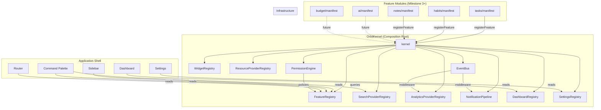

# Orbit — Final Architecture Hardening

**Objective**: Eliminate every future architectural bottleneck. After this document, the architecture is **frozen**. Implementation only adds features, never redesigns structure.

**Scale target**: 250,000+ LOC, plugins, widgets, mobile/desktop apps, browser extension, public API, third-party extensions.

---

## Design Philosophy

Three principles govern every extension system:

### 1. Registry + Contract
Every extension point is a **typed registry** that accepts implementations conforming to a **typed contract**. The core never knows about specific features — features register themselves.

```
Core defines:   Contract (interface)  +  Registry (collection)
Feature provides: Implementation (class/object conforming to contract)
```

### 2. Pipeline over Direct Call
When an event triggers multiple side effects (task completed → sound + toast + achievement + analytics), use a **pipeline** — not direct imports. This keeps features decoupled and ordering flexible.

### 3. Late Binding over Eager Wiring
Registries are populated at app startup, not at import time. Features register themselves via a manifest — the kernel resolves them. This enables feature flags, lazy loading, and runtime plugin activation.

---

## Kernel Architecture

The kernel is the application's single composition root. Every registry and system is accessed through it. It is created once at app bootstrap and lives for the entire session.

```typescript
// lib/kernel.ts

class OrbitKernel {
  // ── Registries ──
  readonly features:      FeatureRegistry;
  readonly widgets:       WidgetRegistry;
  readonly search:        SearchProviderRegistry;
  readonly analytics:     AnalyticsProviderRegistry;
  readonly notifications: NotificationPipeline;
  readonly dashboard:     DashboardRegistry;
  readonly settings:      SettingsRegistry;
  readonly resources:     ResourceProviderRegistry;
  readonly permissions:   PermissionEngine;
  readonly events:        TypedEventBus;

  // ── Feature Registration ──
  // This is the ONLY entry point for features.
  // A feature provides a manifest; the kernel distributes
  // its contributions to the correct registries.
  registerFeature(manifest: FeatureManifest): void {
    if (!isFeatureEnabled(manifest.featureFlag)) return;

    this.features.register(manifest);
    manifest.routes?.forEach(r       => this.features.addRoute(r));
    manifest.navItems?.forEach(n     => this.features.addNavItem(n));
    manifest.commands?.forEach(c     => this.features.addCommand(c));
    manifest.widgets?.forEach(w      => this.widgets.register(w));
    manifest.searchProviders?.forEach(s => this.search.register(s));
    manifest.settingsPanels?.forEach(p  => this.settings.register(p));
    manifest.dashboardCards?.forEach(d  => this.dashboard.register(d));
    manifest.resourceProviders?.forEach(r => this.resources.register(r));
    manifest.analyticsProviders?.forEach(a => this.analytics.register(a));
    manifest.notificationHandlers?.forEach(h => this.notifications.addHandler(h));
    manifest.permissionPolicies?.forEach(p => this.permissions.addPolicy(p));

    manifest.activate?.({ kernel: this, events: this.events });
  }
}

// Singleton — created once in app/providers.tsx
export const kernel = new OrbitKernel();
```

**Key property**: The kernel is a **passive coordinator**. It holds registries and distributes feature contributions. It has no business logic. It never needs modification when features are added.

---

## Extension Contracts

Every contract below is a TypeScript interface. Features implement them. The kernel stores them. The shell renders them.

---

### Contract 1: FeatureManifest

The master contract. Every feature module exports exactly one manifest.

```typescript
interface FeatureManifest {
  // ── Identity ──
  id: string;                         // unique, e.g. 'tasks', 'ai-planning'
  name: string;                       // display name
  description?: string;
  version: string;
  featureFlag?: FeatureFlag;          // gate behind flag (undefined = always on)

  // ── Contributions ──
  routes?:               RouteDefinition[];
  navItems?:             NavItem[];
  commands?:             CommandDefinition[];
  widgets?:              WidgetDefinition[];
  searchProviders?:      SearchProvider[];
  settingsPanels?:       SettingsPanel[];
  dashboardCards?:       DashboardCardDefinition[];
  resourceProviders?:    ResourceProvider[];
  analyticsProviders?:   AnalyticsProvider[];
  notificationHandlers?: NotificationHandler[];
  permissionPolicies?:   PermissionPolicy[];

  // ── Lifecycle ──
  activate?(context: FeatureContext): void;    // called on registration
  deactivate?(): void;                         // called on feature disable
}

interface FeatureContext {
  kernel: OrbitKernel;
  events: TypedEventBus;
}
```

**Usage in a future feature module:**
```typescript
// features/tasks/manifest.ts
export const tasksManifest: FeatureManifest = {
  id: 'tasks',
  name: 'Tasks',
  version: '1.0.0',
  routes: [
    { path: 'tasks', loader: () => import('./pages/tasks-page') },
    { path: 'tasks/:taskId', loader: () => import('./pages/task-detail-page') },
  ],
  navItems: [
    { id: 'tasks', label: 'Tasks', icon: CheckSquare, path: 'tasks',
      section: 'main', order: 20, badge: () => useTaskCount() },
  ],
  commands: [
    { id: 'new-task', label: 'New Task', icon: Plus, shortcut: ['c'],
      action: () => openQuickAdd('task') },
    { id: 'go-tasks', label: 'Go to Tasks', icon: CheckSquare,
      shortcut: ['g', 't'], action: () => navigate('tasks') },
  ],
  searchProviders: [taskSearchProvider],
  dashboardCards: [taskSummaryCard, tasksDueCard],
  settingsPanels: [taskSettingsPanel],
  widgets: [taskListWidget, taskKanbanWidget],
};
```

---

### Contract 2: RouteDefinition

```typescript
interface RouteDefinition {
  path: string;                                    // relative to workspace
  loader: () => Promise<{ default: React.FC }>;    // lazy import
  handle?: RouteHandle;                            // metadata for breadcrumbs, etc.
  children?: RouteDefinition[];
}

interface RouteHandle {
  title: string;
  breadcrumb?: string | ((params: Record<string, string>) => string);
  requiredRole?: WorkspaceRole;
}
```

---

### Contract 3: NavItem

```typescript
interface NavItem {
  id: string;
  label: string;
  icon: LucideIcon;
  path: string;                          // relative to workspace root
  section: 'main' | 'secondary' | 'footer';
  order: number;                         // sort within section
  shortcut?: { keys: string[] };         // go-to shortcut, e.g. ['g', 't']
  badge?: () => number | undefined;      // dynamic unread/count badge
  requiredRole?: WorkspaceRole;          // minimum role to see
  featureFlag?: FeatureFlag;             // hide if flag disabled
  children?: NavItem[];                  // nested group (collapsible)
  isExternal?: boolean;                  // opens in new tab
}
```

---

### Contract 4: CommandDefinition

Commands appear in the command palette (Ctrl+K).

```typescript
interface CommandDefinition {
  id: string;
  label: string;
  description?: string;
  icon?: LucideIcon;
  shortcut?: string[];                   // keyboard shortcut
  keywords?: string[];                   // search aliases
  group: 'navigation' | 'action' | 'settings' | 'help';
  action: () => void | Promise<void>;
  when?: () => boolean;                  // conditional visibility
}
```

---

### Contract 5: WidgetDefinition

Widgets are embeddable UI blocks for dashboards and feature pages.

```typescript
type WidgetSize = '1x1' | '1x2' | '2x1' | '2x2' | '3x2' | 'full';

interface WidgetDefinition {
  id: string;
  featureId: string;                     // which feature owns this widget
  name: string;
  description?: string;
  sizes: WidgetSize[];                   // supported sizes
  defaultSize: WidgetSize;
  component: () => Promise<{ default: React.FC<WidgetProps> }>;
  configSchema?: ZodType;               // widget-level settings
  defaultConfig?: Record<string, unknown>;
}

interface WidgetProps {
  size: WidgetSize;
  config: Record<string, unknown>;
  onConfigChange: (config: Record<string, unknown>) => void;
}
```

**Widget lifecycle:**
1. Dashboard loads → reads user's widget layout from API
2. For each slot, kernel resolves `WidgetDefinition` by id
3. Component is lazy-loaded
4. Config is passed as props
5. User can resize, reorder, configure, remove

---

### Contract 6: SearchProvider

Features contribute searchable content to the unified command palette.

```typescript
interface SearchProvider {
  id: string;
  name: string;                          // "Tasks", "Notes", "Habits"
  icon: LucideIcon;
  priority: number;                      // higher = results shown first
  maxResults?: number;                   // default 5

  search(query: string, context: SearchContext): Promise<SearchResult[]>;
  getRecent?(context: SearchContext): Promise<SearchResult[]>;
}

interface SearchContext {
  workspaceId: string;
  userId: string;
  limit: number;
}

interface SearchResult {
  id: string;
  title: string;
  subtitle?: string;
  icon?: LucideIcon;
  emoji?: string;
  category: string;                      // provider name for grouping
  score: number;                         // 0-1 relevance
  action: () => void;                    // execute on selection
  preview?: () => Promise<{ default: React.FC }>;  // optional preview panel
}
```

**Search flow:**
1. User types in command palette
2. Kernel fans out query to all registered `SearchProvider.search()` in parallel
3. Results are merged, sorted by score, grouped by category
4. Top results from each category are displayed
5. Selection triggers `result.action()`

---

### Contract 7: AnalyticsProvider

Multiple analytics backends can coexist (internal metrics, Mixpanel, PostHog, etc.).

```typescript
interface AnalyticsProvider {
  id: string;
  name: string;

  track(event: string, properties?: Record<string, unknown>): void;
  identify(userId: string, traits?: Record<string, unknown>): void;
  page(name: string, properties?: Record<string, unknown>): void;
  reset(): void;                         // on sign-out
}
```

**Integration with EventBus:**
The analytics registry auto-subscribes to the event bus. Every emitted event is forwarded to all analytics providers:

```typescript
// In kernel setup:
events.use((event, data) => {
  analytics.trackAll(event, data);
});
```

This means features never call analytics directly. They emit events; analytics providers consume them automatically.

---

### Contract 8: NotificationHandler

Notifications flow through a priority-ordered pipeline. Each handler decides whether to act and passes control to the next.

```typescript
interface NotificationHandler {
  id: string;
  name: string;
  priority: number;                      // lower = runs first
  
  canHandle(notification: AppNotification): boolean;
  handle(
    notification: AppNotification,
    context: NotificationContext,
  ): void | Promise<void>;
}

interface AppNotification {
  id: string;
  type: string;                          // 'task:assigned', 'achievement:unlocked', etc.
  title: string;
  body?: string;
  icon?: string;
  action?: { label: string; url: string };
  priority: 'low' | 'default' | 'high' | 'urgent';
  timestamp: number;
  metadata?: Record<string, unknown>;
}

interface NotificationContext {
  userId: string;
  workspaceId: string;
  preferences: UserNotificationPreferences;
}
```

**Default pipeline (ordered by priority):**

| Priority | Handler | Behavior |
|:---|:---|:---|
| 10 | `InAppHandler` | Always stores in notification center |
| 20 | `ToastHandler` | Shows sonner toast if app is in foreground |
| 30 | `SoundHandler` | Plays notification sound if enabled |
| 40 | `BrowserPushHandler` | Shows browser push if granted + app in background |
| 50 | `DiscordHandler` | Posts to Discord webhook if configured |
| 60 | `EmailHandler` | Sends email for urgent + unread after 30min |

Features can add custom handlers (e.g., a "Slack integration" plugin adds a SlackHandler at priority 45).

---

### Contract 9: ResourceProvider

Resources (URLs, files, embeds) that features can resolve and render.

```typescript
interface ResourceProvider {
  id: string;
  name: string;
  types: ResourceType[];                 // 'URL', 'YOUTUBE', 'GITHUB', etc.

  canResolve(uri: string): boolean;
  resolve(uri: string): Promise<ResolvedResource>;
  render?: () => Promise<{ default: React.FC<{ resource: ResolvedResource }> }>;
}

interface ResolvedResource {
  uri: string;
  title: string;
  description?: string;
  thumbnail?: string;
  favicon?: string;
  type: ResourceType;
  metadata?: Record<string, unknown>;
}
```

**Usage**: When a task has a resource URL, the kernel finds the matching ResourceProvider, resolves metadata, and renders the appropriate preview (YouTube embed, GitHub repo card, article preview, etc.).

---

### Contract 10: DashboardCardDefinition

Dashboard cards are feature-contributed content blocks.

```typescript
interface DashboardCardDefinition {
  id: string;
  featureId: string;
  title: string;
  description?: string;
  icon?: LucideIcon;
  sizes: WidgetSize[];
  defaultSize: WidgetSize;
  priority: number;                      // default sort order on first visit
  component: () => Promise<{ default: React.FC<DashboardCardProps> }>;
  featureFlag?: FeatureFlag;
}

interface DashboardCardProps {
  workspaceId: string;
  size: WidgetSize;
}
```

**Dashboard rendering:**
1. Dashboard reads user's card layout (ordered list of card IDs + sizes)
2. Falls back to kernel's `dashboard.getDefaults()` (sorted by priority)
3. Each card is lazy-loaded and rendered in a CSS grid
4. Users can drag-reorder, resize, hide cards
5. New features automatically appear in "Add card" picker

---

### Contract 11: SettingsPanel

Each feature contributes settings panels to the Settings page.

```typescript
interface SettingsPanel {
  id: string;
  featureId: string;
  title: string;
  description?: string;
  icon: LucideIcon;
  section: SettingsSection;
  order: number;
  component: () => Promise<{ default: React.FC }>;
  requiredRole?: WorkspaceRole;
}

type SettingsSection =
  | 'account'          // Profile, email, password
  | 'appearance'       // Theme, accent, density, font, motion
  | 'notifications'    // Channels, per-feature toggles
  | 'workspace'        // Members, roles, billing
  | 'integrations'     // Discord, calendar, third-party
  | 'advanced';        // Data export, danger zone
```

**Settings page rendering:**
1. Reads `kernel.settings.getAll()`, grouped by section
2. Renders sidebar nav with sections
3. Each panel is lazy-loaded when selected
4. Adding a new settings panel = adding to feature manifest

---

### Contract 12: PermissionPolicy

Permission engine evaluates policies in priority order. First definitive answer wins.

```typescript
interface PermissionPolicy {
  id: string;
  priority: number;                      // lower = evaluated first

  evaluate(context: PermissionContext): PermissionResult;
}

interface PermissionContext {
  userId: string;
  userRole: WorkspaceRole;
  action: string;                        // 'tasks:create', 'workspace:settings:edit'
  resource?: string;                     // resource ID
  workspaceId: string;
}

type PermissionResult =
  | 'allow'
  | 'deny'
  | 'abstain';                           // pass to next policy
```

**Default policies (ordered):**

| Priority | Policy | Logic |
|:---|:---|:---|
| 0 | `SuperAdminPolicy` | Owners can do everything → `allow` |
| 10 | `FeatureFlagPolicy` | Feature disabled? → `deny` |
| 20 | `RolePolicy` | Check `requiredRole` vs `userRole` |
| 30 | `ResourceOwnerPolicy` | Creator of resource can always edit → `allow` |
| 100 | `DefaultDenyPolicy` | If nobody allowed it → `deny` |

**Usage in components:**
```typescript
const can = usePermission();
if (can('tasks:delete', taskId)) { /* show delete button */ }
```

**Usage in navigation:**
NavItems with `requiredRole` are automatically filtered by the sidebar rendering.

---

### Contract 13: EventBus (Hardened)

Enhanced from the previous review with **middleware** support and **async handlers**.

```typescript
interface EventMiddleware {
  (event: string, data: unknown, next: () => void): void;
}

class TypedEventBus {
  private listeners = new Map<string, Set<EventHandler>>();
  private middleware: EventMiddleware[] = [];

  // ── Middleware ──
  use(mw: EventMiddleware): void;

  // ── Core API ──
  on<K extends keyof EventMap>(
    event: K,
    handler: (data: EventMap[K]) => void | Promise<void>,
  ): () => void;   // returns unsubscribe function

  emit<K extends keyof EventMap>(event: K, data: EventMap[K]): void;

  // ── Debugging ──
  history(limit?: number): Array<{ event: string; data: unknown; timestamp: number }>;
}
```

**Built-in middleware:**

| Middleware | Purpose |
|:---|:---|
| `loggingMiddleware` | Logs events to console in dev mode |
| `analyticsMiddleware` | Forwards all events to `AnalyticsProviderRegistry` |
| `historyMiddleware` | Stores last N events for debugging |

**EventMap** — comprehensive typed event catalog:

```typescript
type EventMap = {
  // ── Tasks ──
  'task:created':    { taskId: string; workspaceId: string };
  'task:updated':    { taskId: string; changes: string[] };
  'task:completed':  { taskId: string; workspaceId: string };
  'task:deleted':    { taskId: string };
  'task:assigned':   { taskId: string; assigneeId: string };

  // ── Habits ──
  'habit:checked':   { habitId: string; date: string; streak: number };
  'habit:created':   { habitId: string };

  // ── Notes ──
  'note:created':    { noteId: string };
  'note:updated':    { noteId: string };

  // ── Study ──
  'timer:started':   { mode: 'pomodoro' | 'stopwatch' };
  'timer:paused':    { elapsed: number };
  'timer:completed': { durationMinutes: number; mode: string };

  // ── Achievements ──
  'achievement:unlocked': { id: string; title: string };
  'achievement:progress': { id: string; current: number; target: number };

  // ── Workspace ──
  'workspace:switched':    { workspaceId: string; slug: string };
  'workspace:member:joined': { userId: string; workspaceId: string };

  // ── System ──
  'theme:changed':     { mode: string };
  'navigation:changed': { from: string; to: string };
  'sound:played':       { sound: string };
  'error:occurred':     { code: string; message: string };

  // ── Extensible ──
  // Plugins can emit custom events via:  events.emit('plugin:my-event' as any, data)
  // Type safety is maintained for core events; plugins use string keys.
};
```

---

## Domain Layer Boundaries

Clear separation prevents cross-cutting concerns from creating spaghetti.

```
┌─────────────────────────────────────────────────────────┐
│                    Presentation Layer                    │
│   components/ui/  components/layout/  pages/            │
│   Renders UI. No business logic. No direct API calls.   │
│   Receives data via props, hooks, and context.          │
├─────────────────────────────────────────────────────────┤
│                    Application Layer                     │
│   features/*/hooks/   features/*/services/              │
│   Orchestrates domain operations. Calls API client.     │
│   Uses TanStack Query for server state.                 │
│   Emits events via EventBus.                            │
├─────────────────────────────────────────────────────────┤
│                      Domain Layer                        │
│   @orbit/shared: types/ constants/ validators/          │
│   Pure domain entities and rules. No framework deps.    │
│   Shared between web, API, mobile, extensions.          │
├─────────────────────────────────────────────────────────┤
│                   Infrastructure Layer                   │
│   lib/api-client.ts  lib/sounds.ts  lib/kernel.ts       │
│   stores/*  providers/*  lib/event-bus.ts               │
│   Framework adapters, storage, networking, engines.     │
└─────────────────────────────────────────────────────────┘
```

**Dependency rule**: Each layer only depends on the layer below it. Never upward.

| Layer | Can import from | Cannot import from |
|:---|:---|:---|
| Presentation | Application, Domain, Infrastructure | — |
| Application | Domain, Infrastructure | Presentation |
| Domain | Nothing (pure) | All others |
| Infrastructure | Domain | Presentation, Application |

**Enforcement**: This is documented convention, not compile-time enforced. At scale, add ESLint import rules (`eslint-plugin-boundaries`) to enforce.

---

## Dependency Injection Boundaries

React apps don't use traditional DI containers. Instead, Orbit uses three injection patterns:

### Pattern 1: Kernel as Service Locator
The kernel is the single place to access registries and system services.
```typescript
import { kernel } from '@/lib/kernel';
kernel.permissions.can('tasks:create');
kernel.events.emit('task:created', { ... });
```
Components never instantiate registries. They access them through the kernel.

### Pattern 2: Context for React Tree
React-specific services use Context providers for tree-scoped injection:
- `ThemeProvider` — theme state + CSS sync
- `QueryProvider` — TanStack Query client
- `ToastProvider` — toast rendering

### Pattern 3: Module Singletons for Pure Services
Non-React services are module-level singletons:
- `eventBus` — singleton, imported directly
- `soundEngine` — singleton, imported directly
- `apiClient` — singleton, imported directly

**Why not a DI container?** React's component model + module system + Context API already provide dependency injection. Adding a container (like InversifyJS) adds complexity without benefit in a React SPA. The kernel's service locator pattern gives us the same benefits with less machinery.

---

## Impact on Existing Architecture

### Files Added to Milestone 2

| # | File | Purpose | Phase |
|:--|:---|:---|:---|
| 1 | `types/registries.ts` | All extension contracts (FeatureManifest, WidgetDefinition, SearchProvider, etc.) | 2.1 |
| 2 | `lib/kernel.ts` | OrbitKernel class with all registry instances | 2.1 |
| 3 | `lib/permissions.ts` | PermissionEngine with policy pipeline | 2.1 |

**Total new files: 3** (the registries are simple typed Maps inside `kernel.ts` initially — they can be extracted to separate files when they grow beyond ~50 lines each)

### Files Updated

| File | Change |
|:---|:---|
| `lib/event-bus.ts` | Add middleware support, history, async handlers |
| `types/navigation.ts` | Merged into `types/registries.ts` (NavItem is now part of extension contracts) |
| `app/providers.tsx` | Initialize kernel and register default middleware |

### Files NOT Added (deferred)
These are **not needed until their features are built** — the contracts are defined, the registries exist, but no implementations are registered:

- No analytics provider implementations (until Mixpanel/PostHog is integrated)
- No notification handler implementations (until notification center is built)
- No resource provider implementations (until tasks support resources)
- No widget implementations (until dashboard is built)
- No search provider implementations (until features have searchable content)
- No settings panel implementations (until settings page is built)

The contracts ensure these implementations will plug in cleanly when the time comes.

---

## Registry Implementation Strategy

Each registry is **deliberately minimal** in Milestone 2:

```typescript
// Generic pattern — every registry follows this shape:
class Registry<T extends { id: string }> {
  private items = new Map<string, T>();

  register(item: T): void {
    this.items.set(item.id, item);
  }

  get(id: string): T | undefined {
    return this.items.get(id);
  }

  getAll(): T[] {
    return Array.from(this.items.values());
  }

  has(id: string): boolean {
    return this.items.has(id);
  }

  unregister(id: string): void {
    this.items.delete(id);
  }
}
```

Specialized registries add domain-specific methods:

| Registry | Extra Methods |
|:---|:---|
| `FeatureRegistry` | `getRoutes()`, `getNavItems()`, `getCommands()` |
| `WidgetRegistry` | `getByFeature(featureId)`, `getBySizes(sizes[])` |
| `SearchProviderRegistry` | `searchAll(query, context)` — fans out to all providers |
| `NotificationPipeline` | `dispatch(notification, context)` — runs pipeline |
| `DashboardRegistry` | `getDefaults()` — returns cards sorted by priority |
| `SettingsRegistry` | `getBySection(section)` — groups panels by section |
| `PermissionEngine` | `can(action, resource?)`, `addPolicy()` |

---

## Updated Final File Inventory (Frozen)

This is the **complete, final** list of files for Milestone 2. No additions or removals after approval.

### Phase 2.1 — Foundation Layer

```
config/env.ts                          # Typed environment config
config/feature-flags.ts                # Feature flag definitions
config/routes.ts                       # Workspace-scoped route path constants
lib/errors.ts                          # AppError hierarchy
lib/event-bus.ts                       # Typed event bus with middleware
lib/api-client.ts                      # Typed HTTP client
lib/kernel.ts                          # OrbitKernel + all registry classes
types/registries.ts                    # ALL extension contracts
types/index.ts                         # Barrel
features/README.md                     # Feature module conventions
```
**Files: 10**

### Phase 2.2 — State & Utilities

```
stores/ui.store.ts                     # Sidebar, command palette, modals
stores/theme.store.ts                  # Mode, accent, radius, density, fontSize, motionLevel
stores/sound.store.ts                  # Enabled, volume, per-sound toggles
stores/accessibility.store.ts          # OS reduced motion, high contrast
stores/index.ts                        # Barrel
lib/date.ts                            # Relative time, formatting
lib/format.ts                          # Numbers, pluralization, truncation
lib/priority.ts                        # Priority label, OKLCH color, icon
lib/color.ts                           # Status colors, avatar colors
lib/routes.ts                          # Workspace-scoped route builders
lib/permissions.ts                     # PermissionEngine with policies
lib/keyboard.ts                        # Keyboard shortcut registration
lib/animation.ts                       # Motion tokens, spring configs, variants
lib/sounds.ts                          # SoundEngine (Web Audio API)
```
**Files: 14**

### Phase 2.3 — Hooks & Providers

```
hooks/use-reduced-motion.ts            # OS prefers-reduced-motion
hooks/use-motion.ts                    # Three-tier motion level
hooks/use-sound.ts                     # Play sounds with preferences
hooks/use-keyboard-shortcut.ts         # Register shortcuts
hooks/use-event-bus.ts                 # Subscribe to events
hooks/use-media-query.ts               # Reactive media query
hooks/use-feature-flag.ts              # Check feature flag
hooks/use-permission.ts                # Permission check hook
hooks/index.ts                         # Barrel
providers/theme-provider.tsx           # Theme class + CSS custom props
providers/query-provider.tsx           # TanStack Query config
providers/toast-provider.tsx           # Sonner config
providers/index.ts                     # Barrel
app/providers.tsx                      # Compose all providers + kernel init
```
**Files: 14**

### Phase 2.4 — Design Components

```
# Installed via shadcn CLI (not hand-written):
components/ui/button.tsx
components/ui/card.tsx
components/ui/input.tsx
components/ui/textarea.tsx
components/ui/avatar.tsx
components/ui/badge.tsx
components/ui/progress.tsx
components/ui/tabs.tsx
components/ui/dialog.tsx
components/ui/dropdown-menu.tsx
components/ui/popover.tsx
components/ui/tooltip.tsx
components/ui/command.tsx
components/ui/scroll-area.tsx
components/ui/separator.tsx
components/ui/sheet.tsx
components/ui/skeleton.tsx

# Custom components:
components/ui/search-input.tsx
components/ui/stat-card.tsx            # Compound component
components/ui/section-header.tsx
components/ui/responsive-grid.tsx
components/ui/index.ts                 # Barrel
```
**Files: 22 (17 shadcn + 5 custom)**

### Phase 2.5 — Application Shell

```
config/navigation.ts                   # Data-driven nav items
components/layout/sidebar.tsx
components/layout/top-bar.tsx
components/layout/mobile-nav.tsx
components/layout/workspace-switcher.tsx
components/layout/user-menu.tsx
components/layout/search-trigger.tsx
components/layout/notification-button.tsx
components/layout/quick-add-button.tsx
components/layout/breadcrumbs.tsx
components/layout/index.ts
```
**Files: 11**

### Phase 2.6 — Layouts & Routing

```
components/layout/app-shell.tsx
components/layout/content-layout.tsx
components/layout/page-container.tsx   # Compound: Header + Content
components/layout/page-header.tsx
components/layout/empty-state.tsx      # Compound: Icon + Title + Description + Action
components/layout/loading-boundary.tsx
components/layout/protected-layout.tsx
components/layout/workspace-layout.tsx
app/error-boundary.tsx

# Pages (14 thin shells):
pages/dashboard.tsx
pages/tasks.tsx
pages/task-detail.tsx
pages/habits.tsx
pages/study.tsx
pages/notes.tsx
pages/calendar.tsx
pages/analytics.tsx
pages/achievements.tsx
pages/activity.tsx
pages/settings.tsx
pages/workspace-settings.tsx
pages/not-found.tsx
pages/index.ts                         # Lazy exports

app/router.tsx
app/App.tsx                            # Rewrite
main.tsx                               # Update import
```
**Files: 25**

### Phase 2.7 — Animations

```
components/motion/page-transition.tsx
components/motion/motion-div.tsx
components/motion/animate-list.tsx
components/motion/index.ts
```
**Files: 4**

### Phase 2.8 — Audio & Verification

```
# Sound engine (lib/sounds.ts) built in Phase 2.2
# Sound hook (hooks/use-sound.ts) built in Phase 2.3
# Sound store (stores/sound.store.ts) built in Phase 2.2
# Event bus wiring in app/providers.tsx (Phase 2.3)
# No additional files needed.

# Verification:
# - pnpm build compiles
# - All routes render
# - Sidebar works
# - Theme toggles
# - Animations play
# - Sound plays
```
**Files: 0 (verification only)**

---

### Grand Total

| Phase | Files |
|:---|:---|
| 2.1 Foundation | 10 |
| 2.2 State & Utils | 14 |
| 2.3 Hooks & Providers | 14 |
| 2.4 Design Components | 22 |
| 2.5 Shell | 11 |
| 2.6 Layouts & Routing | 25 |
| 2.7 Animations | 4 |
| 2.8 Audio & Verification | 0 |
| **Total** | **100** |

Plus 1 update to `packages/shared/src/constants/priorities.ts` (HSL → OKLCH color alignment).

---

## Architecture Freeze Declaration

> [!CAUTION]
> **After approval, this architecture is FROZEN.**
>
> - No new registries may be added during Milestone 2 implementation
> - No contracts may be modified once coded
> - No folder structure changes
> - No state management pattern changes
> - No routing scheme changes
>
> **The only permitted changes during implementation are:**
> - Bug fixes in individual files
> - Adding exports to barrel files
> - Minor type adjustments for compatibility
>
> **Any structural change requires a new architecture review.**

---


