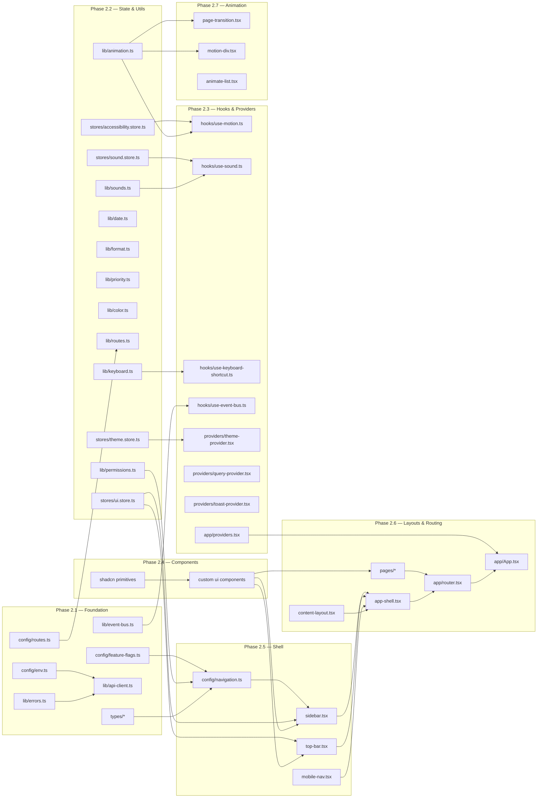

# Orbit — Staff Architecture Review

**Reviewer perspective**: Staff SWE who has shipped products at the scale of Linear, Notion, Vercel.
**Goal**: Ensure the architecture remains clean beyond 100,000 LOC with zero major refactors needed.

---

## Executive Summary

The original plan is structurally sound for a small app, but has **7 critical gaps** and **4 design misalignments** that would require expensive refactors within 6 months:

| Category | Severity | Issue |
|:---|:---|:---|
| Folder structure | 🔴 Critical | Feature-flat won't scale past 30k LOC |
| Routing | 🔴 Critical | No workspace scoping in URLs |
| State management | 🔴 Critical | Server state mixed into Zustand |
| Event system | 🔴 Critical | No decoupled feature communication |
| Feature flags | 🟡 Major | No gating mechanism for incomplete features |
| Error handling | 🟡 Major | No typed error hierarchy |
| Extension points | 🟡 Major | Adding features requires modifying core files |
| Color constants | 🟠 Minor | HSL in shared package vs OKLCH in CSS |
| Theme system | 🟠 Minor | Missing density, radius, font size preferences |
| Navigation | 🟠 Minor | Static config, no permissions/flags support |
| Environment config | 🟠 Minor | No runtime validation on frontend |

The review below addresses all 17 requested areas. Each recommendation includes the exact format: Current → Problem → Improvement → Why → Tradeoffs.

---

## 1. Folder Structure

### Current Design
```
src/
├── components/layout/
├── components/ui/
├── pages/
├── stores/
├── providers/
├── hooks/
├── lib/
└── config/
```
Flat by technical concern. All stores in one directory, all hooks in another, all pages in another.

### Problem
At scale, a developer working on "Tasks" must touch files in 6+ directories: `pages/tasks.tsx`, `stores/tasks.store.ts`, `hooks/useTasks.ts`, `components/tasks/TaskCard.tsx`, `services/tasks.api.ts`, `types/task.types.ts`. This creates:
- **Cognitive scatter**: Hard to understand a feature's full surface area
- **Deletion friction**: Can't remove a feature cleanly
- **Lazy-load boundaries**: Can't code-split a feature module
- **Ownership ambiguity**: No clear feature boundaries for parallel development

Linear, Notion, and Vercel's frontend codebases all use feature-first organization at scale.

### Recommended Improvement
```
src/
├── app/                          # Bootstrap (router, providers, entry)
│   ├── App.tsx
│   ├── router.tsx
│   ├── providers.tsx
│   └── error-boundary.tsx
│
├── config/                       # Static configuration
│   ├── navigation.ts
│   ├── routes.ts
│   ├── env.ts
│   └── feature-flags.ts
│
├── components/
│   ├── layout/                   # Shell (sidebar, topbar, etc.)
│   ├── ui/                       # Design system primitives
│   └── motion/                   # Animation wrappers
│
├── features/                     # Feature modules (Milestone 3+)
│   ├── tasks/
│   │   ├── components/           # Feature-specific components
│   │   ├── hooks/                # Feature-specific hooks
│   │   ├── stores/               # Feature-specific state
│   │   ├── services/             # Feature API calls
│   │   ├── types/                # Feature types
│   │   └── index.ts              # Public API (barrel export)
│   ├── habits/
│   ├── notes/
│   └── ...
│
├── hooks/                        # Shared hooks only
├── lib/                          # Pure utilities (no React)
├── providers/                    # Global providers
├── stores/                       # Global stores only
├── services/                     # Global services (api client, sound engine)
├── types/                        # Global types
├── pages/                        # Thin page shells (compose features)
└── styles/
```

### Why It's Better
- **Feature colocation**: Everything related to "tasks" lives in `features/tasks/`
- **Clean deletion**: Remove `features/budget/` and its route registration = feature gone
- **Lazy-load boundaries**: Each feature exports through a barrel, enabling `React.lazy(() => import('@/features/tasks'))`
- **Parallel development**: Two developers can work on `features/tasks/` and `features/habits/` without merge conflicts
- **Clear API**: Only what's exported from `index.ts` is public; internal components are private

### Tradeoffs
- Slightly more directories initially for an app with few features
- `features/` is empty until Milestone 3 (mitigated by adding a `README.md` with conventions)
- Shared components/hooks stay in top-level dirs — feature-specific ones go in feature dirs

---

## 2. Routing

### Current Design
Routes like `/dashboard`, `/tasks`, `/tasks/:id`, `/settings`. No workspace scoping.

### Problem
Orbit is a **multi-workspace** app. Without workspace in the URL:
- Can't deep-link to a specific workspace's tasks
- Can't share a URL that opens the right workspace
- Can't have two workspaces open in different browser tabs
- Must rely on Zustand state for "current workspace" — lost on refresh

Every successful multi-tenant SaaS puts the tenant in the URL: Linear (`/team-slug/`), Notion (`/workspace/`), GitHub (`/org/`), Slack (`/client/workspace/`).

### Recommended Improvement
```
/                                   → Redirect to default workspace
/w/:workspaceSlug                   → Dashboard (default landing)
/w/:workspaceSlug/tasks             → Tasks list
/w/:workspaceSlug/tasks/:taskId     → Task detail
/w/:workspaceSlug/habits            → Habits
/w/:workspaceSlug/study             → Study
/w/:workspaceSlug/notes             → Notes
/w/:workspaceSlug/calendar          → Calendar
/w/:workspaceSlug/analytics         → Analytics
/w/:workspaceSlug/achievements      → Achievements
/w/:workspaceSlug/activity          → Activity
/w/:workspaceSlug/settings          → Workspace settings

/settings                           → User settings (global, not workspace-scoped)
/auth/login                         → Auth
/auth/signup                        → Auth

/404                                → Not found
```

**Layout nesting** with React Router:
```
RootLayout                          (providers, error boundary)
├── AuthLayout                      (login, signup — no sidebar)
├── AppShell                        (sidebar + topbar + outlet)
│   ├── WorkspaceLayout             (loads workspace by slug from URL)
│   │   ├── Dashboard
│   │   ├── Tasks
│   │   ├── TaskDetail
│   │   └── ...
│   └── UserSettings                (global settings)
└── NotFound
```

The `WorkspaceLayout` component:
1. Reads `:workspaceSlug` from URL params
2. Fetches workspace data via TanStack Query
3. Sets workspace context for all child routes
4. Shows loading/error states if workspace can't be loaded

### Why It's Better
- **Shareable URLs**: Every piece of content has a permanent link
- **Multi-tab support**: Open two workspaces in two tabs
- **SSR-ready**: URL contains all context needed to render (future-proofing)
- **Browser history**: Back/forward works correctly across workspaces
- **Workspace data loading**: Tied to route lifecycle, not global state mutation

### Tradeoffs
- Every internal link must include workspace slug (mitigated by route builder helpers in `lib/routes.ts`)
- Slightly longer URLs

---

## 3. Layout Architecture

### Current Design
Separate `AppShell`, `ContentLayout`, `PageHeader`, `EmptyState`, `LoadingBoundary` components. Each page manually composes them.

### Problem
Without a standardized page framework, every page author must remember to wrap content in `ContentLayout`, add `PageHeader`, handle loading/empty states. This leads to inconsistency and boilerplate.

### Recommended Improvement
Keep the individual components but add a `PageContainer` compound component:

```tsx
// Usage in any page:
<PageContainer>
  <PageContainer.Header
    title="Tasks"
    description="Manage your team's tasks"
    actions={<Button>New Task</Button>}
  />
  <PageContainer.Content width="wide">
    {/* page content */}
  </PageContainer.Content>
</PageContainer>
```

`ContentLayout` supports width variants:
- `narrow` (640px) — settings, forms
- `default` (960px) — most pages
- `wide` (1200px) — dashboard, analytics
- `full` (100%) — calendar, kanban

### Why It's Better
- Consistent page structure across all pages
- Single place to modify page chrome (padding, max-width, scroll behavior)
- Width variants prevent every page from reinventing responsive constraints

### Tradeoffs
- Compound component is slightly more complex than simple props — but much more flexible for future slot patterns

---

## 4. State Management

### Current Design
All state in Zustand stores: `workspace.store.ts` (workspace data + members), `notification.store.ts` (notification items), `theme.store.ts`, `ui.store.ts`, etc.

### Problem
**Mixing server state and client state is the most common React architecture mistake.** Server state (workspace data, notifications, user profile) has fundamentally different characteristics:

| | Server State | Client State |
|:---|:---|:---|
| Source of truth | Database | Browser |
| Needs refetching | Yes | No |
| Can be stale | Yes | No |
| Shared across users | Yes | No |
| Needs cache invalidation | Yes | No |
| Needs optimistic updates | Yes | No |

Putting workspace data in Zustand means:
- No automatic background refetching when data changes
- No cache deduplication (two components fetching the same workspace = two requests)
- Manual staleness management
- No built-in optimistic updates
- Re-implementing what TanStack Query already does perfectly

### Recommended Improvement

**Server state → TanStack Query** (already installed):
- Workspace data, members, notifications from API
- Cached, deduplicated, auto-refetched
- Used via `useQuery` hooks in feature modules

**Client/UI state → Zustand** (minimal surface):
| Store | Contents |
|:---|:---|
| `ui.store.ts` | Sidebar collapsed, mobile menu open, command palette open/recent, active modal stack |
| `theme.store.ts` | Theme (dark/light/system), accent color, radius, density, fontSize, motionLevel — persisted to localStorage, synced to CSS custom properties |
| `sound.store.ts` | Sound enabled, master volume, per-category toggles |
| `accessibility.store.ts` | OS reduced motion (synced from `prefers-reduced-motion`), high contrast, screen reader hints |

**Session state → Zustand with sessionStorage**:
- Command palette search history
- Recently visited items

**Workspace ID** — stored in URL (`:workspaceSlug`), resolved to full data via TanStack Query in `WorkspaceLayout`.

### Why It's Better
- TanStack Query handles caching, deduplication, background refetching, optimistic updates — for free
- Zustand stays tiny (only true client state)
- No stale workspace data after another user makes changes
- `notification.store.ts` becomes a TanStack Query subscription, automatically refreshing

### Tradeoffs
- Two state systems to understand (TanStack Query + Zustand) — but this is the standard pattern at every company I've seen succeed (Vercel, Linear, Notion all use this split)
- Need to install `@tanstack/react-query-devtools` for debugging (already in deps)

---

## 5. Component Architecture

### Current Design
Flat component list: Button, Card, Input, Dialog, Tabs, StatCard, etc. Each is a single component with props.

### Problem
Complex components like `Dialog`, `Tabs`, `Command`, `StatCard` become props-heavy over time. A `StatCard` with `title`, `value`, `trend`, `icon`, `description`, `action`, `loading`, `empty`, `color` = 9+ props. This doesn't compose.

### Recommended Improvement
Use **compound components** for complex widgets:

```tsx
// Instead of <StatCard title="Tasks" value={42} trend={+5} icon={Check} />
// Use:
<StatCard>
  <StatCard.Icon><Check /></StatCard.Icon>
  <StatCard.Value>42</StatCard.Value>
  <StatCard.Label>Tasks Completed</StatCard.Label>
  <StatCard.Trend value={5} />
</StatCard>
```

For shadcn primitives (Dialog, Tabs, Command, Sheet, DropdownMenu), use their **built-in compound pattern** — they already export `DialogTrigger`, `DialogContent`, `DialogHeader`, etc. No change needed there.

**Custom compound components to build**:
- `StatCard` (Icon, Value, Label, Trend, Footer)
- `PageContainer` (Header, Content, Footer)
- `EmptyState` (Icon, Title, Description, Action)

**Simple components (props-based)**:
- Button, Input, Textarea, Avatar, Badge, Progress, Skeleton, Separator, SearchInput, SectionHeader, ResponsiveGrid

### Why It's Better
- Composition over configuration
- Each sub-component is independently stylable
- Easy to add new slots without breaking existing usage
- Matches shadcn/Radix patterns that developers already know

### Tradeoffs
- Slightly more verbose JSX for simple cases — but much more flexible for complex ones

---

## 6. Navigation System

### Current Design
Static `navigation.ts` with hardcoded nav items.

### Problem
Can't gate items behind feature flags, permissions, or workspace configuration. Can't add plugin-contributed nav items. Can't show dynamic badges (unread counts).

### Recommended Improvement

```typescript
// src/types/navigation.ts
export interface NavItem {
  id: string;
  label: string;
  icon: LucideIcon;
  path: string;                          // relative to workspace
  shortcut?: { keys: string[] };         // e.g. ['g', 't'] for go-to-tasks
  badge?: () => number | undefined;      // dynamic badge resolver
  requiredRole?: WorkspaceRole;          // minimum role to see this item
  featureFlag?: string;                  // only show if flag is enabled
  section: 'main' | 'secondary' | 'footer';
  order: number;
  children?: NavItem[];                  // nested groups (future)
}
```

Navigation config becomes a **function** that accepts context:

```typescript
export function getNavItems(context: {
  workspaceSlug: string;
  userRole: WorkspaceRole;
  flags: FeatureFlags;
}): NavItem[]
```

The sidebar iterates `getNavItems()` and automatically:
1. Filters by `requiredRole` (permission check)
2. Filters by `featureFlag` (feature gate)
3. Resolves `badge()` functions (dynamic counts)
4. Sorts by `section` → `order`

### Why It's Better
- Adding a nav item = adding an entry to config, not modifying Sidebar.tsx
- Feature flags naturally hide unreleased features
- Permissions prevent unauthorized navigation
- Plugins can register nav items by appending to the config

### Tradeoffs
- More indirection than a simple static array — but this is exactly the pattern Linear and Notion use

---

## 7. Theme System

### Current Design
`theme.store.ts` with dark/light/system toggle. Applies `.dark` class to `<html>`.

### Problem
The design system spec and the existing `UserPreferences` type in `packages/shared` already define: `accentColor`, `animationsEnabled`, `soundsEnabled`, `reducedMotion`. The user explicitly asked for: accent colors, corner radius, density, motion level, font size. The current plan only handles dark/light.

### Recommended Improvement

Merge visual customization into `theme.store.ts`:

```typescript
interface ThemeState {
  // Mode
  mode: 'dark' | 'light' | 'system';
  resolvedMode: 'dark' | 'light';   // computed from mode + system preference

  // Visual customization
  accentColor: string;               // oklch value, default: violet
  radius: 'none' | 'sm' | 'md' | 'lg' | 'xl';
  density: 'compact' | 'default' | 'comfortable';
  fontSize: 'sm' | 'md' | 'lg' | 'xl';
  motionLevel: 'full' | 'reduced' | 'none';
}
```

The store's `subscribe` handler applies changes to CSS custom properties on `<html>`:

```typescript
// When accentColor changes:
document.documentElement.style.setProperty('--primary', accentColor);

// When radius changes:
document.documentElement.style.setProperty('--radius', radiusMap[radius]);

// When density changes:
document.documentElement.dataset.density = density;
// CSS: [data-density="compact"] { --spacing-unit: 0.2rem; }
```

**Preset accent colors** (matching OKLCH design tokens):
| Name | Value |
|:---|:---|
| Violet (default) | `oklch(0.65 0.22 285)` |
| Blue | `oklch(0.65 0.18 250)` |
| Green | `oklch(0.65 0.18 155)` |
| Orange | `oklch(0.70 0.18 50)` |
| Rose | `oklch(0.65 0.22 340)` |
| Teal | `oklch(0.65 0.18 195)` |

### Why It's Better
- Matches existing `UserPreferences` type in `@orbit/shared`
- All visual preferences live in one store
- CSS custom property changes are instant (no re-renders)
- Density and font size support accessibility needs
- Motion level provides three tiers (not just on/off)

### Tradeoffs
- More CSS custom properties to manage — but they're all in one place
- Accent color change requires recomputing several derived tokens (accent-hover, accent-muted) — solvable with OKLCH lightness manipulation

---

## 8. Animation System

### Current Design
`lib/animation.ts` with Framer Motion presets. A few wrapper components. `useReducedMotion` hook.

### Problem
No centralized spring configs matching the design spec. No motion level system (full/reduced/none — the spec says `prefers-reduced-motion` should disable high-movement transitions but allow simple fades). No way for the user to choose "no animations at all."

### Recommended Improvement

**Centralized motion tokens** (`lib/animation.ts`):
```typescript
export const MOTION = {
  spring: {
    tactile: { type: 'spring', stiffness: 450, damping: 28 },    // buttons, toggles
    smooth:  { type: 'spring', stiffness: 300, damping: 30 },     // menus, sidebars
    bounce:  { type: 'spring', stiffness: 400, damping: 22 },     // achievements
  },
  transition: {
    fade:     { duration: 0.15, ease: 'easeInOut' },               // overlays
    slide:    { duration: 0.22, ease: [0.16, 1, 0.3, 1] },        // pages
    micro:    { duration: 0.1,  ease: 'easeOut' },                 // hover states
  },
  variants: {
    pageEnter: { initial: { opacity: 0, x: 24 }, animate: { opacity: 1, x: 0 } },
    pageExit:  { exit: { opacity: 0, x: -12 } },
    fadeIn:    { initial: { opacity: 0 }, animate: { opacity: 1 } },
    slideUp:   { initial: { opacity: 0, y: 8 }, animate: { opacity: 1, y: 0 } },
    scaleIn:   { initial: { opacity: 0, scale: 0.95 }, animate: { opacity: 1, scale: 1 } },
    float:     { animate: { y: [-4, 4, -4] }, transition: { duration: 4, repeat: Infinity } },
  },
} as const;
```

**`useMotion()` hook** — respects three-tier motion level:
```typescript
export function useMotion() {
  const motionLevel = useThemeStore(s => s.motionLevel);
  const osReduced = useReducedMotion();
  const effective = osReduced ? 'reduced' : motionLevel;

  return {
    level: effective,
    isEnabled: effective !== 'none',
    isFull: effective === 'full',
    // Returns appropriate transition based on level
    getTransition: (type: 'spring' | 'fade' | 'slide') => {
      if (effective === 'none') return { duration: 0 };
      if (effective === 'reduced') return MOTION.transition.fade;
      return MOTION.spring[type] ?? MOTION.transition[type];
    },
  };
}
```

### Why It's Better
- Single source of truth for all motion values (matches design spec exactly)
- Three-tier motion (full → reduced → none) respects both OS and user preference
- `useMotion()` hook makes it trivial for any component to be motion-aware
- All spring constants match the design system spec verbatim

### Tradeoffs
- Every animated component must call `useMotion()` — but this is a one-liner that prevents accessibility issues

---

## 9. Audio System

### Current Design
`lib/sounds.ts` with Web Audio API synthesis + `useSound` hook.

### Problem
No AudioContext lifecycle management (browsers require user gesture to initialize AudioContext). No sound categories with separate volume. No extensibility for custom sound packs.

### Recommended Improvement

**`SoundEngine` class** (`lib/sounds.ts`):
```typescript
class SoundEngine {
  private ctx: AudioContext | null = null;
  private masterGain: GainNode | null = null;
  private categoryGains: Map<SoundCategory, GainNode>;

  // Lazy initialization on first user gesture
  private ensureContext(): AudioContext { ... }

  // Play a named sound
  play(sound: SoundName): void { ... }

  // Volume control
  setMasterVolume(v: number): void { ... }
  setCategoryVolume(cat: SoundCategory, v: number): void { ... }
  setMute(muted: boolean): void { ... }
}

export const soundEngine = new SoundEngine();

type SoundCategory = 'ui' | 'achievement' | 'notification' | 'timer';
type SoundName =
  | 'task_complete'    // C5→C6 chime (from design spec)
  | 'click'            // A5 sweep (from design spec)
  | 'timer_start'      // ascending 330→440
  | 'timer_pause'      // descending 440→330
  | 'trophy'           // C5-E5-G5 arpeggio fanfare
  | 'error'            // 180Hz sawtooth
  | 'notification';    // soft ping
```

**`useSound` hook**:
```typescript
export function useSound() {
  const { enabled, volume } = useSoundStore();
  return {
    play: (sound: SoundName) => {
      if (!enabled) return;
      soundEngine.play(sound);
    },
  };
}
```

### Why It's Better
- Lazy AudioContext respects browser autoplay policies
- Category-based volume (UI clicks quieter than achievement fanfares)
- Singleton engine — no AudioContext proliferation
- Sound names are typed — can't play a sound that doesn't exist
- All frequencies/durations match the design spec exactly

### Tradeoffs
- Web Audio API synthesized sounds may not match production polish of samples — but avoids download overhead and works offline

---

## 10. Event System (NEW)

### Current Design
Not in plan. Features communicate by importing each other directly.

### Problem
When a task is completed, multiple things must happen:
1. Play completion sound
2. Show success toast
3. Check achievement milestones
4. Log analytics event
5. Update activity feed
6. Animate confetti (on milestone)

Without an event bus, the task completion handler must import sound, toast, achievement, analytics, activity, and animation modules — creating a **dependency web**. Adding a 7th reaction (e.g., Discord webhook) requires modifying the task module.

### Recommended Improvement

**Typed event bus** (`lib/event-bus.ts`):
```typescript
type EventMap = {
  'task:created':      { taskId: string; workspaceId: string };
  'task:completed':    { taskId: string; workspaceId: string };
  'task:deleted':      { taskId: string };
  'habit:checked':     { habitId: string; date: string; streak: number };
  'note:created':      { noteId: string };
  'timer:started':     { mode: 'pomodoro' | 'stopwatch' };
  'timer:completed':   { durationMinutes: number };
  'achievement:unlocked': { id: string; title: string };
  'workspace:switched':   { workspaceId: string; slug: string };
  'theme:changed':        { mode: string };
  'navigation:changed':   { from: string; to: string };
};

class TypedEventBus {
  private listeners = new Map<string, Set<Function>>();

  on<K extends keyof EventMap>(event: K, handler: (data: EventMap[K]) => void): () => void;
  emit<K extends keyof EventMap>(event: K, data: EventMap[K]): void;
}

export const eventBus = new TypedEventBus();
```

**React hook** (`hooks/use-event-bus.ts`):
```typescript
export function useEventBus<K extends keyof EventMap>(
  event: K,
  handler: (data: EventMap[K]) => void
): void {
  // Auto-subscribes on mount, unsubscribes on unmount
}
```

**Usage pattern** — each module subscribes independently:
```typescript
// In sound provider:
useEventBus('task:completed', () => soundEngine.play('task_complete'));

// In achievement provider:
useEventBus('task:completed', ({ taskId }) => checkMilestone(taskId));

// In analytics:
useEventBus('task:completed', ({ taskId }) => trackEvent('task_complete', { taskId }));
```

### Why It's Better
- **Zero coupling**: Task module emits an event, doesn't know who's listening
- **Open/closed**: Adding a new reaction = adding a new listener, not modifying the emitter
- **Type-safe**: TypeScript enforces correct event names and payload shapes
- **Testable**: Mock the event bus in tests to verify events are emitted

### Tradeoffs
- Indirect control flow — harder to trace "what happens when X" (mitigated by TypeScript types and the event map serving as documentation)
- Not a replacement for direct function calls in simple cases

---

## 11. Error Handling

### Current Design
Single `ErrorBoundary.tsx` component. No typed errors.

### Problem
All errors are treated the same. A network timeout, a 403 permission error, and a JavaScript runtime error need different UX:
- Network timeout → "Connection lost, retrying..."
- 403 → "You don't have permission. Contact workspace admin."
- Runtime → "Something went wrong. Click to retry."

Without typed errors, the error boundary can't distinguish these cases.

### Recommended Improvement

**Error type hierarchy** (`lib/errors.ts`):
```typescript
export class AppError extends Error {
  constructor(
    message: string,
    public code: string,
    public status?: number,
    public context?: Record<string, unknown>,
    public isRetryable: boolean = false,
  ) { super(message); }
}

export class ApiError extends AppError {
  constructor(status: number, code: string, message: string) {
    super(message, code, status, undefined, status >= 500);
  }
}

export class PermissionError extends AppError {
  constructor(action: string, resource: string) {
    super(`No permission to ${action} ${resource}`, 'PERMISSION_DENIED', 403);
  }
}

export class NetworkError extends AppError {
  constructor() {
    super('Network connection lost', 'NETWORK_ERROR', undefined, undefined, true);
  }
}

export class NotFoundError extends AppError {
  constructor(resource: string) {
    super(`${resource} not found`, 'NOT_FOUND', 404);
  }
}
```

**Error boundary with contextual recovery**:
```tsx
<ErrorBoundary
  fallback={(error, retry) => {
    if (error instanceof PermissionError) return <PermissionDenied />;
    if (error instanceof NotFoundError) return <NotFound />;
    if (error.isRetryable) return <RetryableError onRetry={retry} />;
    return <GenericError />;
  }}
>
  <Outlet />
</ErrorBoundary>
```

**API client integration**: The API client catches HTTP errors and throws typed `ApiError` instances that the error boundary can handle.

### Why It's Better
- Different error types get different UX
- `isRetryable` flag enables automatic retry UI
- Type-safe error handling in catch blocks
- Error context includes debugging info without exposing it to users

### Tradeoffs
- More error classes to maintain — but each is small and focused

---

## 12. Environment Configuration

### Current Design
`vite-env.d.ts` declares 3 env vars. No runtime validation.

### Problem
If `VITE_API_URL` is missing, the app silently uses `undefined` as the API base URL, causing cryptic fetch errors. No defaults. No distinction between required and optional vars.

### Recommended Improvement

**Typed env config** (`config/env.ts`):
```typescript
interface EnvConfig {
  apiUrl: string;
  wsUrl: string;
  clerkPublishableKey: string;
  isDev: boolean;
  isProd: boolean;
}

function loadEnv(): EnvConfig {
  const required = (key: string): string => {
    const val = import.meta.env[key];
    if (!val) throw new Error(`Missing required env var: ${key}`);
    return val;
  };

  return {
    apiUrl: import.meta.env.VITE_API_URL ?? '/api',
    wsUrl: import.meta.env.VITE_WS_URL ?? '',
    clerkPublishableKey: required('VITE_CLERK_PUBLISHABLE_KEY'),
    isDev: import.meta.env.DEV,
    isProd: import.meta.env.PROD,
  };
}

export const env = loadEnv();
```

### Why It's Better
- Fails fast at startup if required vars are missing
- Single typed access point: `env.apiUrl` instead of `import.meta.env.VITE_API_URL`
- Defaults for development (e.g., `apiUrl` defaults to `/api` which uses the Vite proxy)

### Tradeoffs
- Minimal — this is universally recommended

---

## 13. Feature Flags (NEW)

### Current Design
Not in plan.

### Problem
Without feature flags:
- Can't ship incomplete features behind a gate
- Can't A/B test
- Can't progressively roll out
- Nav items for unreleased features (AI, Budget, Mood Tracker) would need to be commented out

### Recommended Improvement

**Feature flag system** (`config/feature-flags.ts`):
```typescript
export const FEATURE_FLAGS = {
  // Milestone 3+
  TASKS: true,
  HABITS: true,
  NOTES: true,
  STUDY: true,
  CALENDAR: true,
  ANALYTICS: true,
  ACHIEVEMENTS: true,

  // Future features (gated off by default)
  AI_PLANNING: false,
  AI_SUMMARIES: false,
  VOICE_INPUT: false,
  OCR: false,
  BUDGET_TRACKING: false,
  MEAL_PLANNER: false,
  MOOD_TRACKER: false,
  RELATIONSHIP_JOURNAL: false,
  SHARED_WHITEBOARD: false,
  DISCORD_INTEGRATION: false,
  OFFLINE_MODE: false,
} as const;

export type FeatureFlag = keyof typeof FEATURE_FLAGS;

// Runtime overrides from API or localStorage (for dev)
export function isFeatureEnabled(flag: FeatureFlag): boolean {
  const devOverride = localStorage.getItem(`ff:${flag}`);
  if (devOverride !== null) return devOverride === 'true';
  return FEATURE_FLAGS[flag];
}
```

**React hook**:
```typescript
export function useFeatureFlag(flag: FeatureFlag): boolean {
  return useMemo(() => isFeatureEnabled(flag), [flag]);
}
```

**Integration with navigation**: Nav items specify `featureFlag?: FeatureFlag` — items with disabled flags are automatically hidden.

### Why It's Better
- Unreleased features can be merged without being visible
- Devs can enable flags locally via localStorage for testing
- API-driven flags enable per-workspace feature gating (future)
- Navigation, routing, and commands all respect flags automatically

### Tradeoffs
- Adds a small layer of indirection — but prevents accidental feature exposure

---

## 14. Extension Points (NEW)

### Current Design
Not in plan. Adding a feature requires modifying `router.tsx`, `navigation.ts`, and potentially `Sidebar.tsx`.

### Problem
Violates open/closed principle. Every new feature requires changes to core files, increasing merge conflict risk and coupling.

### Recommended Improvement

**Feature registration pattern** — each feature module exports a manifest:

```typescript
// features/tasks/index.ts
export const tasksFeature: FeatureManifest = {
  id: 'tasks',
  navItems: [
    { id: 'tasks', label: 'Tasks', icon: CheckSquare, path: 'tasks', section: 'main', order: 20 },
  ],
  routes: [
    { path: 'tasks', component: lazy(() => import('./pages/TasksPage')) },
    { path: 'tasks/:taskId', component: lazy(() => import('./pages/TaskDetailPage')) },
  ],
  commands: [
    { id: 'new-task', label: 'New Task', icon: Plus, action: () => { /* open quick add */ } },
  ],
};
```

**Feature registry** (`config/features.ts`):
```typescript
import { tasksFeature } from '@/features/tasks';
import { habitsFeature } from '@/features/habits';

export const features: FeatureManifest[] = [
  tasksFeature,
  habitsFeature,
  // ... add features here
];
```

The router, sidebar, and command palette all read from this registry. Adding a feature = creating the module + adding one line to the registry.

> [!IMPORTANT]
> This pattern is for **Milestone 3+** when features are built. For Milestone 2, we define the `FeatureManifest` type and registry, but register no features. The placeholder pages are still direct route entries.

### Why It's Better
- Adding a feature is additive, not invasive
- Each feature is self-describing (routes, nav, commands)
- Feature flags integrate naturally (only register enabled features)
- Supports future plugin/extension system

### Tradeoffs
- More abstraction than direct route/nav definitions — but pays for itself by the 3rd feature module

---

## 15. Future Proofing

### Current Design
Feature-flat structure. Future features (AI, voice, OCR) would scatter files across many directories.

### Problem
Each future feature (budget tracking, mood tracker, meal planner, shared whiteboard) would add 5-10 files across pages/, hooks/, stores/, types/, services/. At 15 features, this is 75+ files scattered with no clear boundaries.

### Recommended Improvement
The **feature module pattern** (section 1 + 14) solves this completely:

```
features/
├── tasks/          ← Milestone 3
├── habits/         ← Milestone 3
├── notes/          ← Milestone 3
├── study/          ← Milestone 3
├── calendar/       ← Milestone 4
├── analytics/      ← Milestone 4
├── achievements/   ← Milestone 4
├── ai-planning/    ← Future (feature-flagged)
├── voice-input/    ← Future (feature-flagged)
├── budget/         ← Future (feature-flagged)
├── mood-tracker/   ← Future (feature-flagged)
└── whiteboard/     ← Future (feature-flagged)
```

Each module is:
- Self-contained (own components, hooks, stores, services, types)
- Self-registering (exports a `FeatureManifest`)
- Feature-flagged (only loaded when enabled)
- Lazy-loaded (via `React.lazy`)
- Deletable (remove directory + registry line)

### Why It's Better
- Infinite horizontal scalability — each feature is isolated
- Teams can own features independently
- Feature flags prevent incomplete features from appearing
- Code-splitting happens naturally at feature boundaries

### Tradeoffs
- None meaningful — this is the proven pattern at scale

---

## 16. Developer Experience

### Current Design
`@/` path alias configured. No naming conventions documented.

### Problem
1. **Color format mismatch**: `packages/shared/src/constants/priorities.ts` uses HSL (`hsl(0, 84%, 60%)`) but `globals.css` and the design system spec use OKLCH. This will cause visual inconsistency when priority colors are used in the frontend.
2. **No naming conventions**: Unclear whether files should be PascalCase (`Sidebar.tsx`) or kebab-case (`sidebar.tsx`).
3. **No barrel export conventions**: Some directories have `index.ts`, some don't.

### Recommended Improvement

**Naming conventions**:
| Type | Convention | Example |
|:---|:---|:---|
| Component files | kebab-case | `sidebar.tsx`, `page-header.tsx` |
| Store files | kebab-case with `.store` suffix | `ui.store.ts`, `theme.store.ts` |
| Hook files | kebab-case with `use-` prefix | `use-sound.ts`, `use-motion.ts` |
| Utility files | kebab-case | `date.ts`, `format.ts` |
| Type files | kebab-case | `navigation.ts`, `errors.ts` |
| Constants | SCREAMING_SNAKE_CASE | `FEATURE_FLAGS`, `MOTION` |
| Components | PascalCase (in code) | `export function Sidebar()` |

**Why kebab-case for files**: Matches shadcn convention (`button.tsx`, `dialog.tsx`), case-insensitive on all filesystems, and is the de facto React community standard.

**Fix color mismatch**: Update `packages/shared/src/constants/priorities.ts` to use OKLCH values matching the design system spec. Since these colors are used on the frontend with Tailwind/CSS that uses OKLCH, they must match.

**Barrel exports**: Every directory with 2+ exported files gets an `index.ts`.

### Why It's Better
- Consistent codebase reduces cognitive load
- Matches shadcn conventions (the project's UI foundation)
- Color consistency between shared package and CSS

### Tradeoffs
- Renaming existing files is a one-time cost (only `App.tsx` exists currently as PascalCase — keeping it since it's the root component is fine)

---

## 17. Performance

### Current Design
Manual chunks in `vite.config.ts` for vendor/query/motion. `React.lazy` for pages.

### Problem
Good start, but missing:
- Virtualization plan for long lists (tasks list, activity feed, analytics data)
- No memoization guidelines
- No image lazy loading pattern
- No prefetching strategy for anticipated navigations

### Recommended Improvement

**Virtualization**: Add `@tanstack/react-virtual` to dependencies. Create a `useVirtualList` hook wrapper. Required for:
- Task list (could be hundreds of items)
- Activity feed (infinite scroll)
- Analytics data tables
- Note folder tree (deeply nested)

**Route prefetching**: On sidebar link hover, prefetch the route's code bundle:
```typescript
// In Sidebar nav link:
onMouseEnter={() => {
  // Triggers React.lazy to start loading
  import('@/pages/tasks');
}}
```

**Memoization guidelines** (documented, not enforced):
- `useMemo` for expensive computations (sorting, filtering large arrays)
- `useCallback` for callbacks passed to memoized children
- Do NOT wrap everything — React 19's compiler handles most cases

**Bundle analysis**: Add `rollup-plugin-visualizer` as dev dependency for periodic bundle size audits.

### Why It's Better
- Virtualization prevents performance cliffs when data grows
- Route prefetching makes navigation feel instant
- Memoization guidelines prevent both over- and under-optimization
- Bundle analysis catches bloat early

### Tradeoffs
- `@tanstack/react-virtual` is a new dependency (4.8KB gzipped — negligible)
- Route prefetching adds complexity to nav links — but the UX improvement is significant

---

## Updated Folder Structure

```
apps/web/src/
│
├── app/                              # Application bootstrap
│   ├── App.tsx                       # Root component (mounts providers + router)
│   ├── router.tsx                    # React Router configuration
│   ├── providers.tsx                 # Provider composition tree
│   └── error-boundary.tsx            # Global error boundary
│
├── config/                           # Static configuration
│   ├── navigation.ts                 # Data-driven nav items with permissions/flags
│   ├── routes.ts                     # Route path constants
│   ├── env.ts                        # Typed environment config
│   └── feature-flags.ts             # Feature flag definitions
│
├── components/
│   ├── layout/                       # Application shell
│   │   ├── app-shell.tsx             # Root layout: sidebar + topbar + outlet
│   │   ├── sidebar.tsx               # Collapsible sidebar navigation
│   │   ├── top-bar.tsx               # Top navigation bar
│   │   ├── mobile-nav.tsx            # Bottom tab bar for mobile
│   │   ├── workspace-switcher.tsx    # Workspace dropdown
│   │   ├── user-menu.tsx             # Avatar + profile dropdown
│   │   ├── search-trigger.tsx        # Ctrl+K search button
│   │   ├── notification-button.tsx   # Bell icon with badge
│   │   ├── quick-add-button.tsx      # Floating + button
│   │   ├── breadcrumbs.tsx           # Dynamic breadcrumb trail
│   │   ├── content-layout.tsx        # Scrollable content area
│   │   ├── page-header.tsx           # Reusable page title + actions
│   │   ├── page-container.tsx        # Compound page framework
│   │   ├── empty-state.tsx           # Illustrated empty state
│   │   ├── loading-boundary.tsx      # Suspense fallback wrapper
│   │   ├── protected-layout.tsx      # Auth gate
│   │   ├── workspace-layout.tsx      # Workspace context loader
│   │   └── index.ts                  # Barrel exports
│   │
│   ├── ui/                           # Design system primitives
│   │   ├── button.tsx
│   │   ├── card.tsx
│   │   ├── input.tsx
│   │   ├── textarea.tsx
│   │   ├── avatar.tsx
│   │   ├── badge.tsx
│   │   ├── progress.tsx
│   │   ├── tabs.tsx
│   │   ├── dialog.tsx
│   │   ├── dropdown-menu.tsx
│   │   ├── popover.tsx
│   │   ├── tooltip.tsx
│   │   ├── command.tsx
│   │   ├── search-input.tsx
│   │   ├── skeleton.tsx
│   │   ├── separator.tsx
│   │   ├── scroll-area.tsx
│   │   ├── sheet.tsx
│   │   ├── stat-card.tsx             # Compound: Icon, Value, Label, Trend
│   │   ├── section-header.tsx
│   │   ├── responsive-grid.tsx
│   │   └── index.ts
│   │
│   └── motion/                       # Animation wrappers
│       ├── page-transition.tsx
│       ├── motion-div.tsx
│       ├── animate-list.tsx
│       └── index.ts
│
├── features/                         # Feature modules (Milestone 3+)
│   └── README.md                     # Feature module conventions & template
│
├── hooks/                            # Shared hooks
│   ├── use-reduced-motion.ts
│   ├── use-motion.ts                 # Motion level + transition resolver
│   ├── use-sound.ts
│   ├── use-keyboard-shortcut.ts
│   ├── use-event-bus.ts
│   ├── use-media-query.ts
│   ├── use-feature-flag.ts
│   └── index.ts
│
├── lib/                              # Pure utilities (no React imports)
│   ├── utils.ts                      # cn() helper (exists)
│   ├── date.ts                       # Relative time, formatting
│   ├── format.ts                     # Numbers, pluralization, truncation
│   ├── priority.ts                   # Priority label/color/icon mapping
│   ├── animation.ts                  # Motion tokens, spring configs, variants
│   ├── color.ts                      # Status colors, avatar colors
│   ├── routes.ts                     # Workspace-scoped route builders
│   ├── permissions.ts                # Role-based permission checks
│   ├── keyboard.ts                   # Shortcut registration
│   ├── sounds.ts                     # SoundEngine class (Web Audio API)
│   ├── event-bus.ts                  # Typed event bus
│   ├── errors.ts                     # AppError hierarchy
│   └── api-client.ts                 # Typed HTTP client
│
├── providers/                        # Global React providers
│   ├── theme-provider.tsx            # Dark/light class + CSS custom props
│   ├── query-provider.tsx            # TanStack Query client
│   ├── toast-provider.tsx            # Sonner config
│   └── index.ts
│
├── stores/                           # Zustand (client state only)
│   ├── ui.store.ts                   # Sidebar, command palette, mobile menu, modals
│   ├── theme.store.ts                # Mode, accent, radius, density, fontSize, motionLevel
│   ├── sound.store.ts                # Enabled, volume, per-sound toggles
│   ├── accessibility.store.ts        # OS reduced motion, high contrast
│   └── index.ts
│
├── types/                            # Global TypeScript types
│   ├── navigation.ts                 # NavItem, NavSection, FeatureManifest
│   ├── errors.ts                     # Error type re-exports
│   └── index.ts
│
├── pages/                            # Thin page shells (lazy-loaded)
│   ├── dashboard.tsx
│   ├── tasks.tsx
│   ├── task-detail.tsx
│   ├── habits.tsx
│   ├── study.tsx
│   ├── notes.tsx
│   ├── calendar.tsx
│   ├── analytics.tsx
│   ├── achievements.tsx
│   ├── activity.tsx
│   ├── settings.tsx
│   ├── workspace-settings.tsx
│   ├── not-found.tsx
│   └── index.ts                      # Lazy exports
│
├── styles/
│   └── globals.css                   # Design tokens (exists, frozen)
│
├── main.tsx                          # Entry point
└── vite-env.d.ts                     # Env type declarations
```

---

## Updated Implementation Plan

Phases reordered for correct dependency resolution. Phases that are independent can be parallelized.

### Phase 2.1 — Foundation Layer (no UI)
*Creates the infrastructure all other phases depend on.*

| # | File | Purpose |
|:--|:---|:---|
| 1 | `config/env.ts` | Typed environment configuration |
| 2 | `config/feature-flags.ts` | Feature flag definitions + `isFeatureEnabled()` |
| 3 | `config/routes.ts` | Route path constants (workspace-scoped) |
| 4 | `lib/errors.ts` | AppError hierarchy (AppError, ApiError, PermissionError, NetworkError, NotFoundError) |
| 5 | `lib/event-bus.ts` | Typed event bus with EventMap |
| 6 | `lib/api-client.ts` | Typed HTTP client (fetch wrapper with auth + workspace headers) |
| 7 | `types/navigation.ts` | NavItem, NavSection, FeatureManifest types |
| 8 | `types/errors.ts` | Error type re-exports |
| 9 | `types/index.ts` | Barrel |
| 10 | `features/README.md` | Feature module conventions documentation |

---

### Phase 2.2 — State & Utilities
*Zustand stores (client state only) + pure utility functions.*

| # | File | Purpose |
|:--|:---|:---|
| 1 | `stores/ui.store.ts` | Sidebar, command palette, mobile menu, modal stack |
| 2 | `stores/theme.store.ts` | Mode, accent, radius, density, fontSize, motionLevel (persisted to localStorage, synced to CSS) |
| 3 | `stores/sound.store.ts` | Enabled, master volume, per-category + per-sound toggles |
| 4 | `stores/accessibility.store.ts` | OS reduced motion sync, high contrast |
| 5 | `stores/index.ts` | Barrel |
| 6 | `lib/date.ts` | Relative time, format date, calendar helpers |
| 7 | `lib/format.ts` | Number formatting, pluralization, truncation |
| 8 | `lib/priority.ts` | Priority label, color (OKLCH), icon mapping |
| 9 | `lib/color.ts` | Status colors, avatar color generation |
| 10 | `lib/routes.ts` | Workspace-scoped route builder: `routes.tasks(slug)` → `/w/home/tasks` |
| 11 | `lib/permissions.ts` | Role-based permission checks |
| 12 | `lib/keyboard.ts` | Keyboard shortcut registration |
| 13 | `lib/animation.ts` | Motion tokens, spring configs, Framer variants (from design spec) |
| 14 | `lib/sounds.ts` | SoundEngine class (Web Audio API, categories, lazy AudioContext) |

---

### Phase 2.3 — Hooks & Providers
*React hooks + provider tree.*

| # | File | Purpose |
|:--|:---|:---|
| 1 | `hooks/use-reduced-motion.ts` | Detects OS `prefers-reduced-motion` |
| 2 | `hooks/use-motion.ts` | Three-tier motion level + transition resolver |
| 3 | `hooks/use-sound.ts` | Play sounds respecting user preferences |
| 4 | `hooks/use-keyboard-shortcut.ts` | Register keyboard shortcuts |
| 5 | `hooks/use-event-bus.ts` | Subscribe to typed events with auto-cleanup |
| 6 | `hooks/use-media-query.ts` | Reactive media query matching |
| 7 | `hooks/use-feature-flag.ts` | Check feature flag status |
| 8 | `hooks/index.ts` | Barrel |
| 9 | `providers/theme-provider.tsx` | Applies theme class + CSS custom properties |
| 10 | `providers/query-provider.tsx` | TanStack Query client configuration |
| 11 | `providers/toast-provider.tsx` | Sonner toast config |
| 12 | `providers/index.ts` | Barrel |
| 13 | `app/providers.tsx` | Composes all providers into single wrapper |

---

### Phase 2.4 — Design Components
*Install shadcn primitives, then customize. Build custom compound components.*

**Step 1**: Install shadcn base components:
```bash
npx shadcn@latest add button card input textarea badge progress tabs
npx shadcn@latest add dialog dropdown-menu popover tooltip
npx shadcn@latest add command scroll-area separator sheet
npx shadcn@latest add skeleton avatar
```

**Step 2**: Customize + add custom components:

| # | File | Purpose |
|:--|:---|:---|
| 1 | `components/ui/search-input.tsx` | Search field with icon + clear button |
| 2 | `components/ui/stat-card.tsx` | Compound: StatCard, StatCard.Icon, Value, Label, Trend |
| 3 | `components/ui/section-header.tsx` | Section title with optional action |
| 4 | `components/ui/responsive-grid.tsx` | Auto-responsive CSS grid container |
| 5 | `components/ui/index.ts` | Barrel exports for all UI components |

---

### Phase 2.5 — Application Shell
*Sidebar, TopBar, MobileNav, and supporting shell components.*

| # | File | Purpose |
|:--|:---|:---|
| 1 | `config/navigation.ts` | Data-driven nav items with permissions, flags, badges, sections |
| 2 | `components/layout/sidebar.tsx` | Collapsible sidebar with nav, workspace switcher, user menu |
| 3 | `components/layout/top-bar.tsx` | Breadcrumbs + search trigger + notifications + quick-add |
| 4 | `components/layout/mobile-nav.tsx` | Bottom tab bar for mobile viewports |
| 5 | `components/layout/workspace-switcher.tsx` | Dropdown to switch workspaces |
| 6 | `components/layout/user-menu.tsx` | Avatar dropdown with profile/settings/sign-out |
| 7 | `components/layout/search-trigger.tsx` | Ctrl+K button |
| 8 | `components/layout/notification-button.tsx` | Bell icon with unread badge |
| 9 | `components/layout/quick-add-button.tsx` | Floating + button |
| 10 | `components/layout/breadcrumbs.tsx` | Dynamic breadcrumb trail from route hierarchy |
| 11 | `components/layout/index.ts` | Barrel |

---

### Phase 2.6 — Layouts & Routing
*Page framework + route configuration.*

| # | File | Purpose |
|:--|:---|:---|
| 1 | `components/layout/app-shell.tsx` | Root layout: sidebar + topbar + content `<Outlet />` |
| 2 | `components/layout/content-layout.tsx` | Scrollable area with width variants (narrow/default/wide/full) |
| 3 | `components/layout/page-container.tsx` | Compound page framework (Header + Content) |
| 4 | `components/layout/page-header.tsx` | Reusable page title + description + actions |
| 5 | `components/layout/empty-state.tsx` | Compound: Icon, Title, Description, Action |
| 6 | `components/layout/loading-boundary.tsx` | Suspense wrapper with skeleton fallback |
| 7 | `components/layout/protected-layout.tsx` | Auth gate (redirects to /auth if not authenticated) |
| 8 | `components/layout/workspace-layout.tsx` | Reads `:workspaceSlug` from URL, loads workspace context |
| 9 | `app/error-boundary.tsx` | Global error boundary with typed error rendering |
| 10 | Placeholder pages (14 files) | All pages in `pages/` as thin shells with `PageContainer` |
| 11 | `pages/index.ts` | `React.lazy` barrel exports |
| 12 | `app/router.tsx` | React Router config with nested layouts, workspace scoping |
| 13 | `app/App.tsx` | **Rewrite** — mounts providers + router |
| 14 | `main.tsx` | **Update** — imports from `app/App.tsx` |

---

### Phase 2.7 — Animations
*Motion components + reduced motion support.*

| # | File | Purpose |
|:--|:---|:---|
| 1 | `components/motion/page-transition.tsx` | AnimatePresence page enter/exit |
| 2 | `components/motion/motion-div.tsx` | Reusable animated div with preset variants |
| 3 | `components/motion/animate-list.tsx` | Staggered list animation wrapper |
| 4 | `components/motion/index.ts` | Barrel |

---

### Phase 2.8 — Audio
*Sound engine + integration.*

| # | File | Purpose |
|:--|:---|:---|
| 1 | Sound engine already built in Phase 2.2 (`lib/sounds.ts`) | — |
| 2 | Sound hook already built in Phase 2.3 (`hooks/use-sound.ts`) | — |
| 3 | Sound store already built in Phase 2.2 (`stores/sound.store.ts`) | — |
| 4 | Event bus integration | Wire `useEventBus` listeners in providers for sound on events |

---

### Phase 2.9 — Verification & Polish

| # | Task | Method |
|:--|:---|:---|
| 1 | `pnpm build` compiles | Terminal |
| 2 | Dev server starts | `pnpm dev` |
| 3 | All routes render placeholder pages | Browser |
| 4 | Sidebar collapses/expands | Browser |
| 5 | Mobile bottom nav at `<640px` | Browser (responsive) |
| 6 | `Ctrl+K` opens command palette | Browser |
| 7 | Theme toggle (dark/light) works | Browser |
| 8 | Page transitions animate | Browser |
| 9 | Sound plays on interaction | Browser |
| 10 | Reduced motion disables animations | Browser (OS setting) |
| 11 | 404 page renders for unknown routes | Browser |
| 12 | Error boundary catches errors | Browser |

---

## Architecture Diagram

```mermaid
graph TB
    subgraph Entry ["Application Entry"]
        Main["main.tsx"] --> App["App.tsx"]
        App --> Providers["Providers"]
        Providers --> Router["Router"]
    end

    subgraph ProviderStack ["Provider Stack"]
        Providers --> Theme["ThemeProvider"]
        Providers --> Query["QueryProvider"]
        Providers --> Toast["ToastProvider"]
    end

    subgraph Routing ["Route Tree"]
        Router --> AuthLayout["AuthLayout"]
        Router --> AppShell["AppShell"]
        Router --> NotFound["NotFound"]
        AppShell --> WL["WorkspaceLayout"]
        WL --> Pages["Page Components"]
        AppShell --> UserSettings["UserSettings"]
    end

    subgraph Shell ["Application Shell"]
        AppShell --> Sidebar["Sidebar"]
        AppShell --> TopBar["TopBar"]
        AppShell --> MobileNav["MobileNav"]
        Sidebar --> NavItems["Navigation Config"]
        Sidebar --> WSSwitch["WorkspaceSwitcher"]
        Sidebar --> UserMenu["UserMenu"]
        TopBar --> Breadcrumbs["Breadcrumbs"]
        TopBar --> SearchTrigger["SearchTrigger"]
        TopBar --> NotifBtn["NotificationButton"]
        TopBar --> QuickAdd["QuickAddButton"]
    end

    subgraph State ["State Management"]
        ZUI["ui.store"] -.-> Sidebar
        ZTheme["theme.store"] -.-> Theme
        ZSound["sound.store"] -.-> SoundEng["SoundEngine"]
        ZAccess["accessibility.store"] -.-> Theme
        TQ["TanStack Query"] -.-> WL
        TQ -.-> Pages
    end

    subgraph Infra ["Infrastructure"]
        EventBus["EventBus"] -.-> SoundEng
        EventBus -.-> Toast
        APIClient["ApiClient"] -.-> TQ
        FeatureFlags["FeatureFlags"] -.-> NavItems
        Errors["Error Hierarchy"] -.-> AppShell
    end

    subgraph Design ["Design System"]
        UI["components/ui/*"] -.-> Pages
        Motion["components/motion/*"] -.-> Pages
        Tokens["globals.css tokens"] -.-> UI
    end
```



---

## Dependency Graph



---

## Summary of Changes from Original Plan

| Area | Original | Revised |
|:---|:---|:---|
| Folder structure | Feature-flat | Hybrid feature-first with `features/` directory |
| Routing | `/tasks`, `/habits` | `/w/:workspaceSlug/tasks`, `/w/:slug/habits` |
| Server state | Zustand stores | TanStack Query (workspace, notifications, user) |
| Client state | 8 Zustand stores | 4 focused stores (ui, theme, sound, accessibility) |
| Event system | Not planned | Typed EventBus for decoupled feature communication |
| Feature flags | Not planned | Static + runtime flag system |
| Error handling | Single ErrorBoundary | Typed error hierarchy (AppError → ApiError, PermissionError, etc.) |
| Extension points | Not planned | FeatureManifest registration pattern |
| Navigation | Static array | Data-driven with permissions, feature flags, badges |
| Theme system | Dark/light only | +accent, radius, density, fontSize, motionLevel |
| Animation system | Basic presets | Centralized tokens from design spec + three-tier motion level |
| Audio system | Basic sounds | SoundEngine with categories, lazy AudioContext, per-sound toggles |
| Phase ordering | UI-first | Foundation → State → Hooks → Components → Shell → Layouts → Animations → Audio |
| New files added | 0 | 9 (env, flags, event-bus, errors, api-client, types, feature README, use-motion, use-feature-flag) |
| Files consolidated | 0 | 4 stores removed (workspace, notification, presence, command-palette → handled by TanStack Query or merged into ui.store) |
